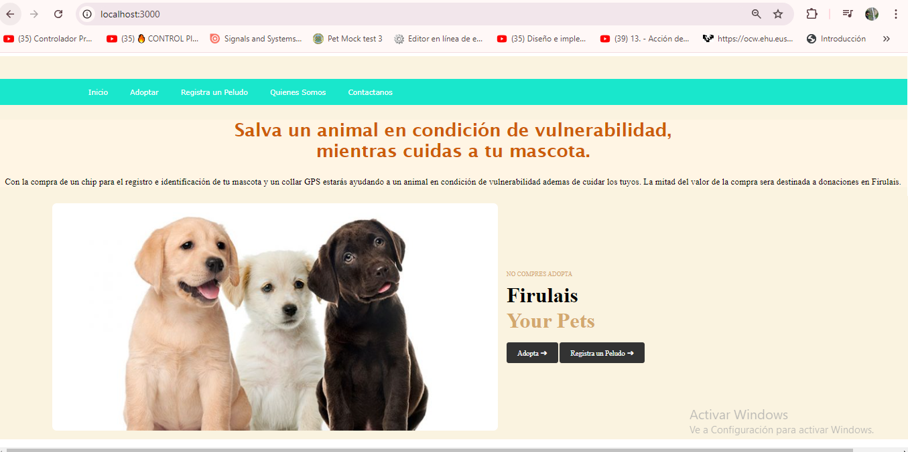

# Proyecto Firulais

## Descripción del Proyecto

**Firulais** es una aplicación web destinada a ayudar en la adopción de mascotas. Nuestro objetivo es crear un espacio donde los usuarios puedan encontrar y adoptar animales en situación de vulnerabilidad. A través de esta plataforma, se busca facilitar la conexión entre personas que desean adoptar y refugios que necesitan ayuda.

### Características Principales

- Registro de mascotas en adopción.
- Información sobre la ubicación y condiciones de vulnerabilidad de cada mascota.
- Interfaz amigable y accesible.
- Funciones de búsqueda y filtrado para facilitar la adopción.

## Tecnologías Utilizadas

- Node.js
- Express.js
- EJS (Embedded JavaScript)
- MySQL


## Captura de Pantalla

Aquí hay una captura de pantalla de la aplicación:



Aquí hay una captura de pantalla de Mascotas para adopción:


Aquí hay un Formulario de Registro de mascotas:


Aqui hay un formulario de Registro de Adoptantes


Aqui hay un formulario de Registro de Donaciones


## Instalación

Para ejecutar este proyecto localmente, sigue los pasos a continuación:

1. Clona el repositorio:
   ```bash
   git clone https://github.com/tu-usuario/firulais.git
    ```
```bash
    cd firulais
```
```bash

npm install
```
